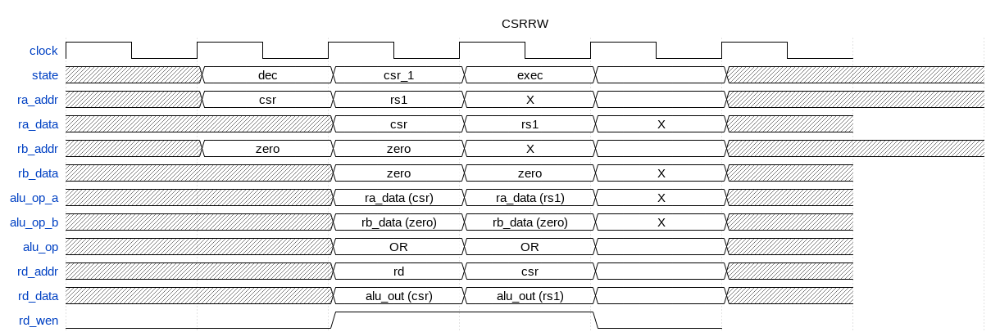
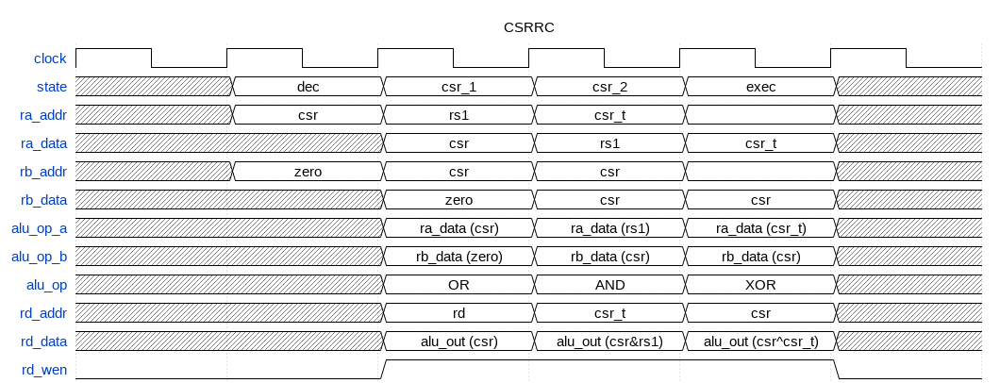

# Register File
fwrisc uses FPGA blockram to implement the core RISC-V registers, as well as the CSRs. 

# Performance Counters

# Execution State Machine
fwrisc uses a state machine to implement instruction execution

# CSR Instructions
The CSR instructions require several steps to execute: 
- reading the target CSR and (optionally) storing the unmodified version to the destination register
- (optionally) Modifying the target CSR based on rs1 and the instruction type

The following diagram shows how a basic CSRRW instruction is implemented

