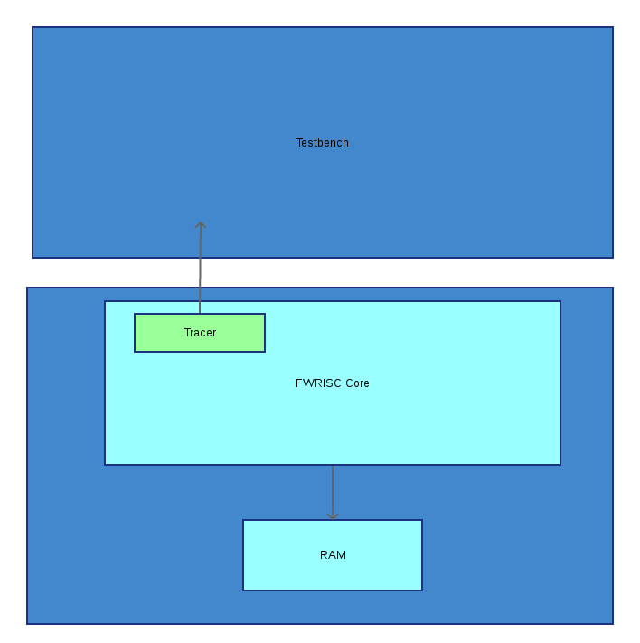

# FWRISC-S Verification

FWRISC uses Verilator as the HDL simulator, and uses a [Googletest](https://github.com/abseil/googletest)-based testbench environment. The HDL top-level is written 
in Verilog, while the testbench and tests are implemented in C++.

FWRISC currently has two testbench environments:
- Core-level testbench, which is used for unit tests, compliance tests, and Zephyr tests
- System-level testbench, which is used to sanity-test the FPGA top-level

The core-level testbench is located in the fwrisc/ve/fwrisc directory. The system-level testbench 
is located in the fwrisc/ve/fwrisc_fpga directory.

## Core-level Tests

A diagram of the core-level testbench is shown below:




The _tracer_ module uses SV-DPI functions to send register-write, memory-write, and instruction trace 
events to the testbench. These events are used to verify the result of running tests, as well
as implement features like function trace and the Zephyr RAM console.


### Unit Tests

The unit tests are each designed to test a single instruction of feature of the core. As such,
the goal is to keep each of these tests as short as possible. The test programs are captured
in-line as part of the test. The expected results are captured within the test as well.

Here is an example unit test for the add-imediate instruction:

```
TEST_F(fwrisc_instr_tests_arith, addi) {
	reg_val_s exp[] = {
			{1, 5},
			{3, 11}
	};
	const char *program = R"(
		entry:
			li		x1, 5
			add		x3, x1, 6
			j		done
			)";

	runtest(program, exp, sizeof(exp)/sizeof(reg_val_s));
}
```

All unit tests are expected to terminate by jumping to the 'done' symbol. The expected register-value array
specifies expected values for all accessed registers. Any registers that are unexpectedly accessed or
registers with an unexpected value will be reported as an error.

### Compliance Tests
Each compliance test runs one of the RISC-V RV32I compliance tests. Success of compliance tests is 
judged by comparing a region of memory to a reference file. The compliance tests determine where this
region of memory is located by reading the ELF symbol table from the test executable, then comparing
the memory written during simulation against the content of memory at the end of the run.


### Zephyr Tests
With the exception of the 'Hello World' test, Zephyr tests tend to run for a long time. Consequently, 
it is recommended to run these tests individually and interactively. 

The Zephyr tests support two command-line options for debug purposes:
- +TRACE_FUNCS -- Displays a trace of function entry/exit driven by symbols read from the ELF file and the execution trace
- +TRACE_INSTR -- Displays each instruction that is executed.

The function trace is very helpful at debugging bringup of a new Zephyr port. Here is a trace of the beginning of Zephyr boot:

```
  ==> __initialize
    ==> _PrepC
      ==> _bss_zero
        ==> memset
          ==> 
          <== 
        ==> _data_copy
          ==> memcpy
            ==> 
            <== 
          ==> _Cstart
            ==> memset
              ==> 
              <== 
            <== memset
            ==> _sys_device_do_config_level
              ==> ram_console_init
                ==> __printk_hook_install
                <== __printk_hook_install
                ==> __stdout_hook_install
                <== __stdout_hook_install
              <== ram_console_init
            <== _sys_device_do_config_level
            ==> _sys_device_do_config_level
              ==> z_clock_driver_init
              <== z_clock_driver_init
            <== _sys_device_do_config_level
            ==> _sched_init
              ==> reset_time_slice
                ==> _get_next_timeout_expiry
                  ==> k_spin_lock.isra.1
                  <== k_spin_lock.isra.1
                <== _get_next_timeout_expiry
                ==> z_clock_elapsed
                <== z_clock_elapsed
                ==> z_clock_set_timeout
            <== _sched_init
            ==> _setup_new_thread
              ==> _new_thread
                ==> _init_thread_base
                <== _init_thread_base
              <== _new_thread
            <== _setup_new_thread
```

The simulation-based Zephyr board definition uses the RAM console to display messages. The Zephyr-tests testbench
determines the local of the RAM console by reading the ELF symbol table. Messages sent to the RAM console are 
displayed on the terminal with a '#' prefix. For example:

```
# ***** Booting Zephyr OS zephyr-v1.13.0-1808-gd18ff80 *****
# threadA: Hello World from fwrisc_sim!
# threadB: Hello World from fwrisc_sim!
# threadA: Hello World from fwrisc_sim!
# threadB: Hello World from fwrisc_sim!

```


## System-level Tests
The System-level tests have a similar structure to the unit-level tests. The main difference is that the testbench
only has access to the LED and UART Tx signals on the boundary of the design.


## Running a Test

Tests for both core- and system-level environments are run from the respective 'sim' directory using the _runtest.pl_ script. 
Before running a test, be sure to configure your tool environment and source the FWRISC project setup script.

Each test is described using a test file in the 'tests' subdirectory. The test file specifies which GoogleTest 
testcase to run, and any options to pass to the test. Here is the test file for the 'ECALL' unit test:

```
--gtest_filter=fwrisc_instr_tests_system.ecall
```

Here is the test file for the ADDI RISCV compliance test:

```
+SW_IMAGE=${BUILD_DIR}/esw/I-ADDI-01.elf
+REF_FILE=${FWRISC}/ve/fwrisc/tests/riscv-compliance/riscv-test-suite/rv32i/references/I-ADDI-01.reference_output
--gtest_filter=riscv_compliance_tests.coretest

``` 

Note how the ELF file and reference file are specified as plusargs to the test.

The example below shows how to run the 'ECALL' unit test:

```
% cd fwrisc-s/ve/fwrisc_rv32imc/sim
% runtest.pl -test tests/fwrisc_instr_tests_system_ecall.f
```


## Running a Testlist

Test suites are captured using testlists. Running a testlist is also done using the _runtest.pl_ script. 
Here is an example of how to run the RISCV Compliance Tests testlist:

```
% cd fwrisc-s/ve/fwrisc_rv32imc/sim
% runtest.pl -testlist testlists/fwrisc_riscv_compliance_tests.tl
```


The full test suite is run with the fwrisc_riscv_all_tests.tl testlist:

```
% cd fwrisc-s/ve/fwrisc/sim
% runtest.pl -testlist testlists/fwrisc_riscv_all_tests.tl
```

